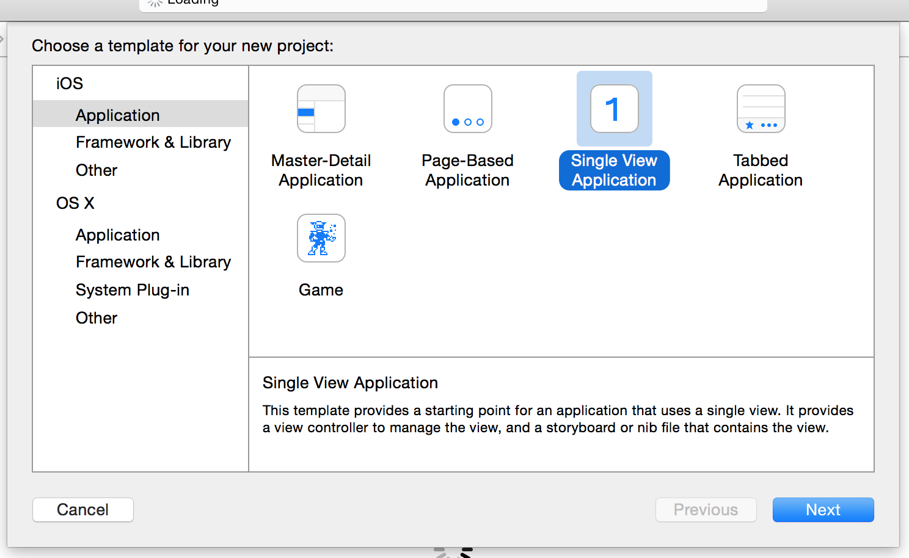
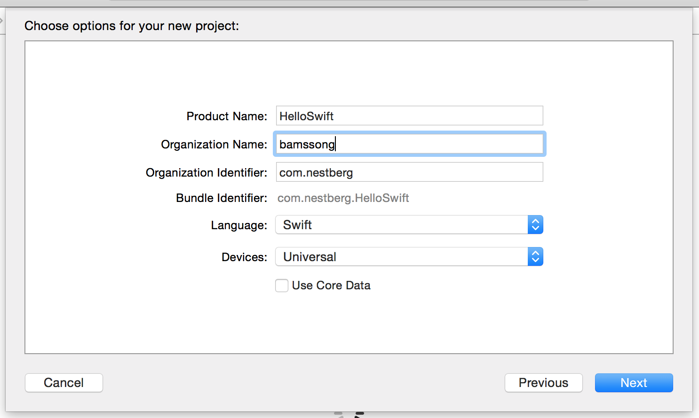
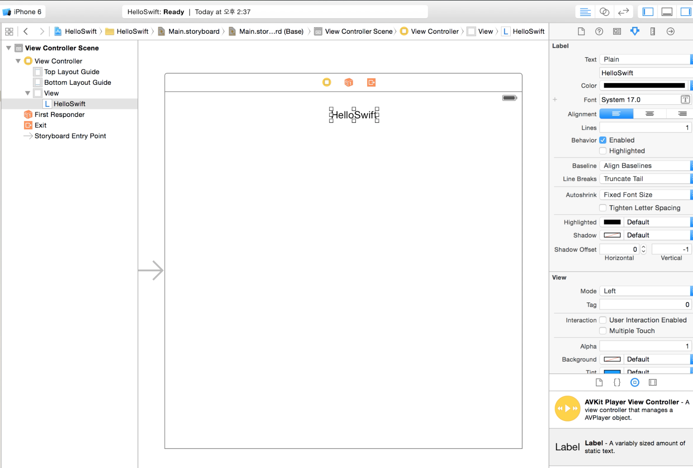

# Hello Swift

## create porject
1. run xcode

2. create a new Xcode project

3. select template.
(= select : Single View Application )

4. set product name & ...
 

- Organization Name : 조직 이름, 앱 스토어에 등록 시 노출

## storyboard 

스토리보드를 이용해서 Label 을 추가하고 'Hello Swift' 넣는다.

 

##  실행한다.

